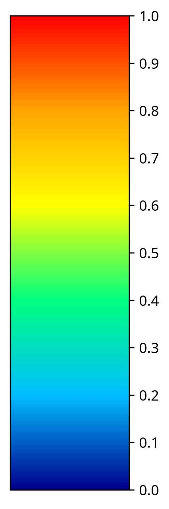
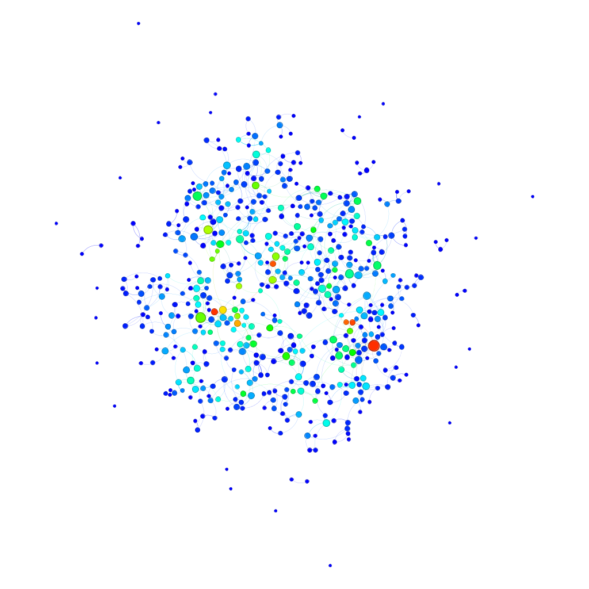
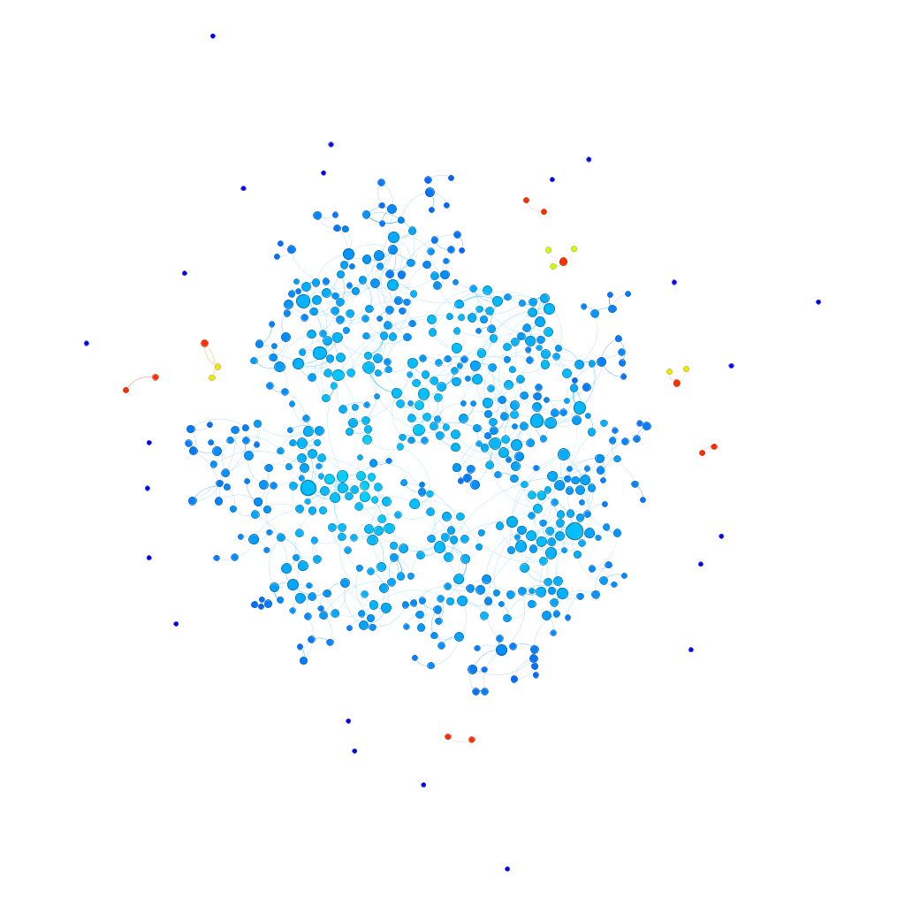
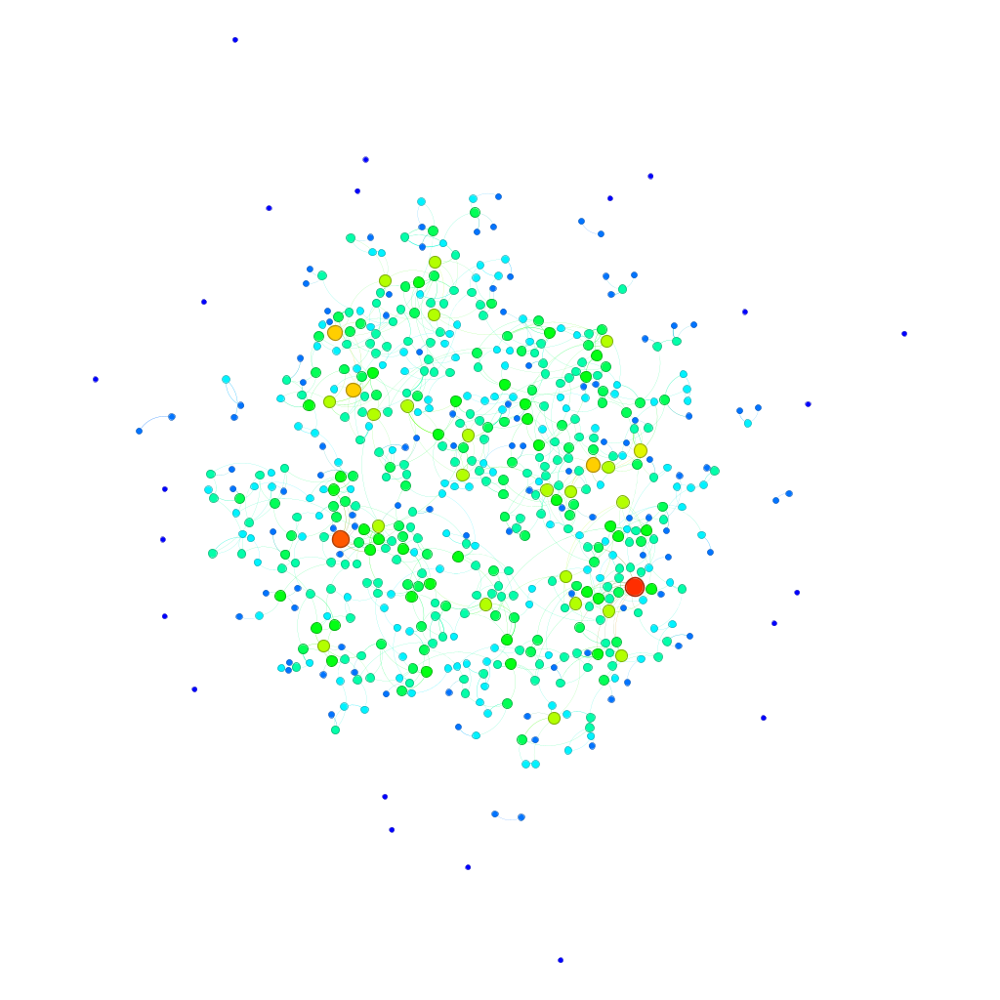
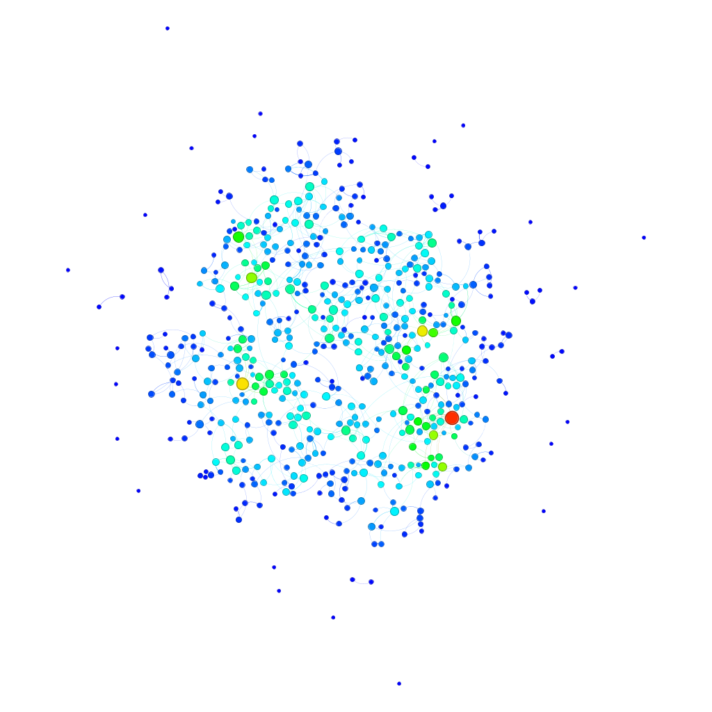
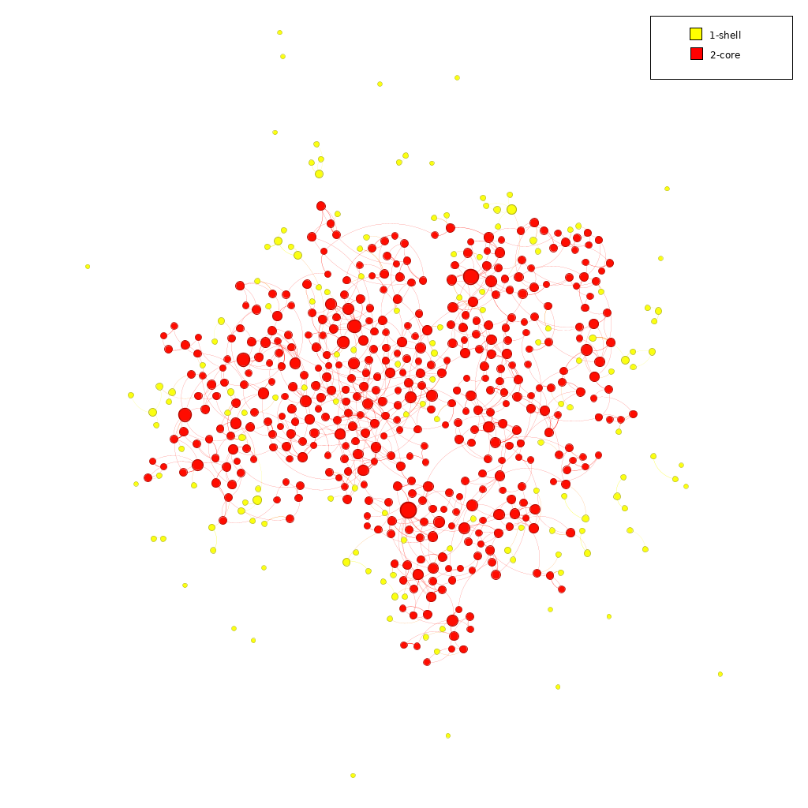
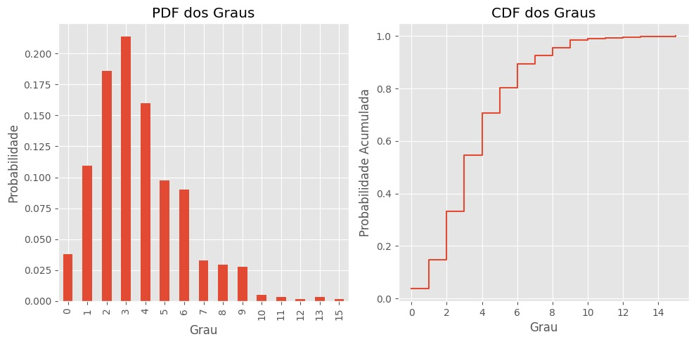
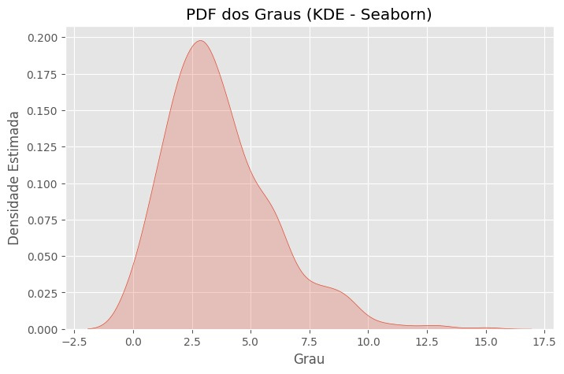
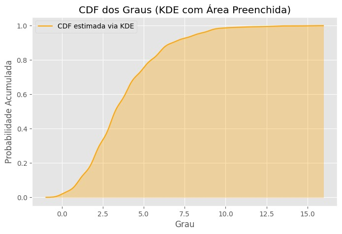
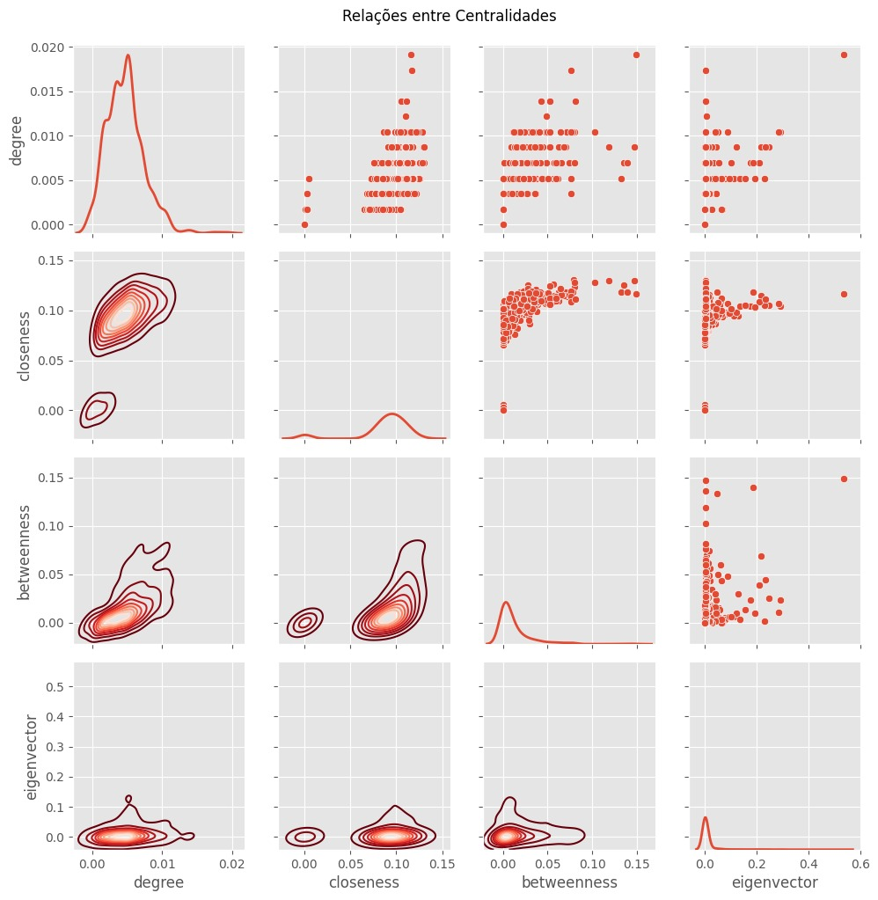

<p align="center">
  
</p>

<h3 align="center"><strong>UNIVERSIDADE FEDERAL DO RIO GRANDE DO NORTE</strong></h3>

<p align="center"> 
DEPARTAMENTO DE ENGENHARIA DE COMPUTAÇÃO E AUTOMAÇÃO 
<br> 
DCA3702 - ALGORITMOS E ESTRUTURAS DE DADOS II  
</p>

<h1 align="center"><strong>PROJETO 07 - TRABALHO FINAL PARTE II</strong></h1>

<strong>DISCENTES:</strong> 
- IAN ANTÔNIO FONSECA DE ARAÚJO
- MATHEUS BEZERRA DANTAS SARAIVA 
- MINNAEL CAMPELO DE OLIVEIRA 

<strong>DOCENTE:</strong>  
- IVANOVITCH MEDEIROS DANTAS DA SILVA  

**Natal/RN — 2025**

---

## <strong>1. PROBLEMÁTICA</strong>

A análise de redes complexas tem se mostrado uma abordagem eficaz para compreender a estrutura e as interações de sistemas biológicos, especialmente em nível molecular. No contexto da hemoglobina, uma proteína fundamental no transporte de oxigênio, é possível representá-la como uma rede de interações entre resíduos aminoácidos, cadeias polipeptídicas ou até entre diferentes conformações estruturais. Propõe-se, assim, a utilização da ferramenta Gephi para explorar uma rede derivada de estruturas tridimensionais de hemoglobinas, aplicando os conceitos de redes complexas discutidos ao longo do curso.

A problemática, portanto, está em como extrair e comunicar, por meio de representações gráficas e métricas quantitativas, características significativas dessas redes moleculares que revelem propriedades estruturais relevantes da hemoglobina. Isso envolve a escolha cuidadosa de layouts, métricas de centralidade, detecção de comunidades e análise de núcleos estruturais, buscando evidenciar padrões que possam estar relacionados à estabilidade, função ou possíveis mutações da proteína. A atividade se insere em um contexto didático e investigativo, que alia ferramentas computacionais à interpretação crítica de sistemas biológicos complexos.

---

## <strong>2. DESENVOLVIMENTO</strong>


#### 2.1 REQUISITO 01

O primeiro requisito propõe a criação de uma visualização da rede em que o tamanho dos vértices seja proporcional ao número de vizinhos (grau), enquanto as cores indiquem uma das métricas de centralidade — Closeness, Betweenness, Degree ou Eigenvector Centrality. Essa etapa busca destacar os vértices mais influentes ou centrais segundo diferentes critérios de conectividade e proximidade. A escolha de um layout adequado é essencial para garantir uma boa percepção visual das variações de cor e tamanho, facilitando a identificação de padrões estruturais relevantes. As figuras geradas devem ser acompanhadas de uma descrição interpretativa, relacionando os aspectos visuais com as propriedades topológicas da rede.

#### 2.2 REQUISITO 02

No segundo requisito, o foco recai sobre a identificação e visualização das estruturas internas da rede por meio da análise de k-core e k-shell. Essas técnicas permitem destacar os subconjuntos mais densamente conectados, revelando os vértices que formam o núcleo da rede. A visualização deverá usar o tamanho dos vértices proporcional ao grau de cada nó, reforçando a percepção dos vértices mais conectados. O layout é de livre escolha, desde que favoreça a clareza da estrutura revelada. A descrição da figura deve contextualizar a função do núcleo e das camadas externas, permitindo compreender como esses elementos se distribuem e se organizam na topologia geral da rede.

#### 2.3 REQUISITO 03

Neste requisito, a análise se concentra na distribuição dos graus dos nós da rede, por meio das funções PDF e CDF. A CDF permite identificar as faixas de grau que contemplam 25%, 50% e 75% dos vértices, revelando a assimetria na conectividade. A PDF destaca os vértices nos extremos, evidenciando os nós com maior e menor grau. Além disso, foi realizada uma análise multivariável das centralidades, cruzando diferentes métricas para identificar os vértices com maior influência estrutural. Por fim, foram destacados os vértices que se encontram na periferia, com baixa centralidade e os que ocupam o centro da rede, caracterizados por alta conectividade e proximidade dos demais nós.

#### 2.4 REQUISITO 04

Por fim, o quarto requisito envolve a reprodução da rede em um estado de “produção”, conforme discutido na Semana 14 do curso. Aqui, as cores dos vértices devem indicar a que comunidade pertencem, revelando agrupamentos de nós com alta densidade de conexões internas. Já o tamanho dos vértices pode ser determinado com base em qualquer métrica de livre escolha, possibilitando a personalização da análise conforme o aspecto mais relevante a ser destacado. Essa etapa tem como objetivo evidenciar a modularidade da rede, ou seja, como ela pode ser decomposta em subestruturas com comportamento coletivo, oferecendo uma visão mais segmentada e interpretável de sua organização.

---

## <strong>3. RESULTADOS</strong>

### Resultados

Antes de apresentar os gráficos gerados, é importante destacar a escala de cores utilizada em todas as visualizações. A legenda abaixo representa o gradiente de intensidade que foi adotado para codificar diferentes métricas nos nós da rede — variando do azul (valores mais baixos) ao vermelho (valores mais altos).

<p align="center">
  
</p>

A rede analisada é composta por 576 nós e 784 arestas, apresentando um grau médio de 2,72 e grau médio ponderado de 3,68. A distância média entre dois nós qualquer é de aproximadamente 9,84, com um diâmetro máximo de 22 e raio mínimo igual a zero, o que sugere a existência de vértices isolados ou perifericamente conectados. A densidade da rede é 0,005, indicando que a rede é bastante esparsa. A análise de comunidades revelou uma modularidade elevada de 0,831, com a detecção de 45 comunidades distintas, sugerindo uma forte estrutura de agrupamentos internos.

Essas métricas ajudam a compreender a topologia geral da rede, contextualizando as representações visuais que seguem. O uso combinado de cor e tamanho nos vértices visa destacar atributos relevantes como centralidade, conectividade e posição relativa, promovendo uma análise mais intuitiva e informativa da estrutura da rede.

A seguir, apresentamos as visualizações geradas no Gephi a partir da rede fornecida, atendendo aos requisitos especificados. Cada imagem é acompanhada de uma breve descrição que destaca os aspectos analisados.

#### Métrica de Centralidade: **Betweenness**

<p align="center">
  
</p>

Na figura acima, o tamanho dos nós representa o grau de conectividade (número de vizinhos), enquanto a coloração dos vértices é baseada na centralidade de intermediação (*Betweenness Centrality*). Os nós em tons mais quentes (vermelho e laranja) exercem papel fundamental como intermediários na comunicação entre diferentes regiões da rede.

#### Métrica de Centralidade: **Closeness**

<p align="center">
  
</p>

Nesta visualização, a coloração reflete a centralidade de proximidade (*Closeness Centrality*), evidenciando os nós que possuem menor distância média até os demais. Quanto mais claro o tom, maior é a capacidade do vértice de alcançar rapidamente os outros elementos da rede.

#### Propriedade de Grau: **Degree**

<p align="center">
  
</p>

A imagem acima apresenta os nós dimensionados proporcionalmente ao seu grau. Os nós maiores são os que possuem mais conexões diretas com outros vértices. Essa representação facilita a identificação de hubs locais que atuam como pontos centrais de atividade na rede.

#### Métrica de Centralidade: **Eigenvector**

<p align="center">
  
</p>

Por fim, nesta figura, os nós são coloridos de acordo com a centralidade de autovetor (*Eigenvector Centrality*), que considera não apenas o número de conexões de um vértice, mas também a importância dos vizinhos com os quais ele está conectado. Isso permite detectar influência estrutural mais ampla na rede.

#### Análise de Núcleo: **K-core e K-shell**

<p align="center">
  
</p>

A imagem acima evidencia a estrutura da rede por meio da decomposição em *k-core* e *k-shell*. Os nós destacados em vermelho pertencem ao núcleo 3-core, ou seja, formam um subgrafo no qual cada vértice possui, no mínimo, três conexões com outros vértices do mesmo grupo. Já os nós em amarelo compõem o 2-shell, representando uma camada menos densa ao redor do núcleo. O tamanho dos vértices foi ajustado de forma proporcional ao grau (número de conexões), permitindo identificar os vértices mais conectados dentro de cada camada.

#### Análise Estrutural e Topológica dos Vértices com Base em Métricas de Centralidade e Distribuição de Grau

A análise das propriedades estruturais da rede foi realizada por meio de quatro tipologias principais de visualização: distribuições de grau (PDF e CDF), análise de densidade suavizada (KDE), relação entre métricas de centralidade e detecção de comunidades. Cada uma dessas abordagens permite extrair interpretações complementares sobre o comportamento e a organização da rede.

As distribuições de grau, tanto a PDF quanto a CDF, oferecem uma visão quantitativa sobre a conectividade dos vértices. A PDF mostra a frequência relativa dos graus presentes na rede, revelando um pico concentrado nos valores 2 e 3, o que indica que a maioria dos nós possui poucas conexões. Isso é característico de redes esparsas. A CDF, por sua vez, fornece uma visão acumulativa, permitindo identificar, por exemplo, que aproximadamente 75% dos nós possuem grau igual ou inferior a 6. Essa informação é útil para distinguir a massa de vértices periféricos, que compõem grande parte da rede, dos poucos vértices mais conectados que compõem seu núcleo.

<p align="center">
  
</p>

A estimativa de densidade por KDE (Kernel Density Estimation), aplicada tanto na PDF quanto na CDF, introduz uma suavização da distribuição. Isso é vantajoso para evidenciar padrões gerais de conectividade, sem os ruídos das frequências discretas. No caso da PDF suavizada, observa-se uma curva assimétrica com cauda longa à direita, indicando a presença de poucos nós com grau elevado os chamados hubs enquanto a maior parte da rede está concentrada em baixos graus. Já a CDF suavizada torna mais fácil identificar os pontos de inflexão na acumulação de probabilidade, o que ajuda na definição de percentis de distribuição de grau.

<p align="center">
  
</p>

<p align="center">
  
</p>

A estimativa de densidade por KDE (Kernel Density Estimation), aplicada tanto na PDF quanto na CDF, introduz uma suavização da distribuição. Isso é vantajoso para evidenciar padrões gerais de conectividade, sem os ruídos das frequências discretas. No caso da PDF suavizada, observa-se uma curva assimétrica com cauda longa à direita, indicando a presença de poucos nós com grau elevado os chamados hubs — enquanto a maior parte da rede está concentrada em baixos graus. Já a CDF suavizada torna mais fácil identificar os pontos de inflexão na acumulação de probabilidade, o que ajuda na definição de percentis de distribuição de grau.

A análise multivariada entre métricas de centralidade permite observar como as diferentes medidas — grau, closeness, betweenness e eigenvector se relacionam. Gráficos de dispersão e curvas de densidade mostram que vértices com alto grau tendem a apresentar também maior centralidade de proximidade (closeness), pois estão, em média, mais próximos dos outros nós da rede. No entanto, essa correlação não é tão forte com a centralidade de autovetor (eigenvector), que leva em conta a influência dos vizinhos. Essa análise é essencial para distinguir os tipos de importância estrutural: enquanto alguns nós são centrais por estarem bem conectados diretamente, outros o são por se conectarem com nós também influentes ou por mediarem caminhos críticos (betweenness).

A excentricidade reflete a posição topológica dos vértices: valores altos indicam nós periféricos, distantes da rede, enquanto valores baixos correspondem a vértices centrais, próximos dos demais. Essa métrica reforça a distinção entre periferia e centro observada nas análises de centralidade e grau.

<p align="center">
  
</p>

Com base nessas visualizações, é possível inferir que os vértices na periferia da rede são aqueles que apresentam simultaneamente baixo grau, baixa centralidade de proximidade e baixa centralidade de autovetor. Eles estão representados nas extremidades inferiores dos gráficos de dispersão e aparecem com baixa densidade nas distribuições. Esses nós têm poucas conexões e estão longe da maioria dos outros vértices, o que os torna menos relevantes na estrutura geral da rede.

Já os vértices centrais da rede são aqueles que se destacam com valores elevados em múltiplas métricas de centralidade. Eles estão próximos de muitos outros nós (alta closeness), conectam regiões distintas da rede (alta betweenness) e se ligam a outros nós influentes (alta eigenvector). Esses nós ocupam posições privilegiadas no núcleo da rede e são fundamentais para a coesão estrutural e para a circulação eficiente de informação.

#### Detecção de Comunidades e Visualização Interativa

O quarto requisito propõe a análise da estrutura modular da rede por meio da detecção de comunidades, técnica fundamental para identificar agrupamentos de nós que compartilham conexões mais densas entre si do que com o restante da rede. Nesta etapa, as cores dos vértices representam as comunidades detectadas por meio de algoritmos de maximização de modularidade, enquanto o tamanho dos vértices foi definido com base em uma métrica de livre escolha (como grau, centralidade ou outro parâmetro estrutural). Essa combinação permite não apenas visualizar a posição dos nós dentro de cada grupo, mas também avaliar a importância relativa de cada vértice no interior das comunidades.

Como complemento às imagens estáticas, foi criada uma visualização interativa em formato de página web, onde é possível explorar dinamicamente a rede com zoom, seleção de nós e inspeção de atributos. Essa interface proporciona uma compreensão mais aprofundada da estrutura global e local da rede, favorecendo a investigação de padrões e a identificação de vértices de interesse com base em múltiplos critérios. A ferramenta foi especialmente útil para observar como os agrupamentos se organizam no espaço topológico da rede e como se conectam entre si.

A visualização interativa está disponível na seção **Informações Complementares** a seguir.


## <strong>Informações Complementares</strong>

Este repositório reúne todos os materiais utilizados para desenvolvimento do projeto, incluindo os notebooks com comentários detalhados e os arquivos de visualização.

- Página gerada no [GEPHI](https://mbdsaraiva.github.io/Complex-structures-and-graphs/PARTE%202/WEB/#)

- Link do vídeo explicativo no [YOUTUBE](https://youtu.be/uSlR6a4N8Zc)

- Os prompts utilizados durante o processo estão documentados na pasta [`MD`](https://github.com/mbdsaraiva/Complex-structures-and-graphs/tree/main/PARTE%202/MD).

- O notebook em Python com toda a lógica do algoritmo bem como os dados aqui utilizados está disponível na pasta [`JUPYTER`](https://github.com/mbdsaraiva/Complex-structures-and-graphs/tree/main/PARTE%202/JUPYTER).

---

## <strong>Detalhes Para a Reprodução do Código</strong>
A reprodução deste projeto pode ser realizada de duas formas distintas:

### 1. Execução Direta via Script Python

Basta executar o arquivo `main.py`, localizado na raiz do projeto. Esse script contém a lógica principal para gerar os resultados desejados de forma automatizada.

#### 💻 Comandos no terminal:

```bash
# Clonar o repositório (se ainda não tiver feito)
git clone https://github.com/mbdsaraiva/Complex-structures-and-graphs.git

# Acessar a pasta do projeto
cd Complex-structures-and-graphs

# Acessar a parte 2
cd PARTE 2

# Executar o script principal
python main.py
```

### 2. Execução Interativa via Jupyter Notebook

Também é possível executar o projeto de forma interativa por meio do Jupyter Notebook disponível na pasta `JUPYTER`. Essa abordagem é recomendada para análises exploratórias ou ajustes manuais nos passos do projeto.

#### 💻 Comandos no terminal:

```bash
# Clonar o repositório (se ainda não tiver feito)
git clone https://github.com/mbdsaraiva/Complex-structures-and-graphs.git

# Acessar a pasta do notebook
cd Complex-structures-and-graphs

# Acessar a parte 2
cd PARTE 2

# Acessar pasta de notebooks
cd JUPYTER

# Iniciar o Jupyter Notebook
jupyter notebook
