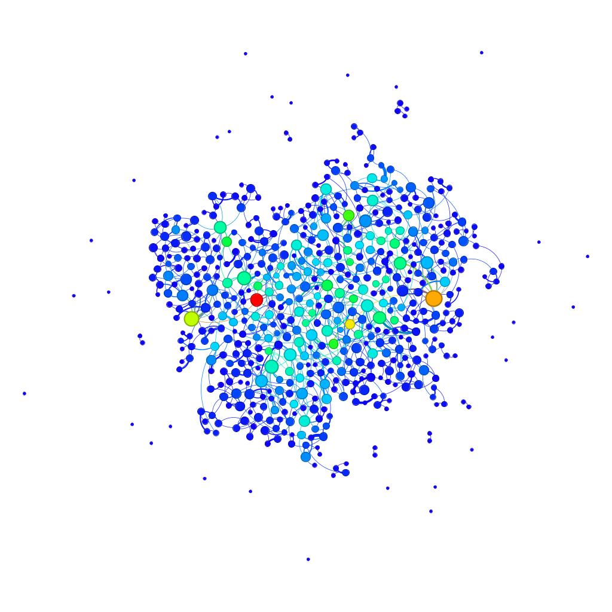
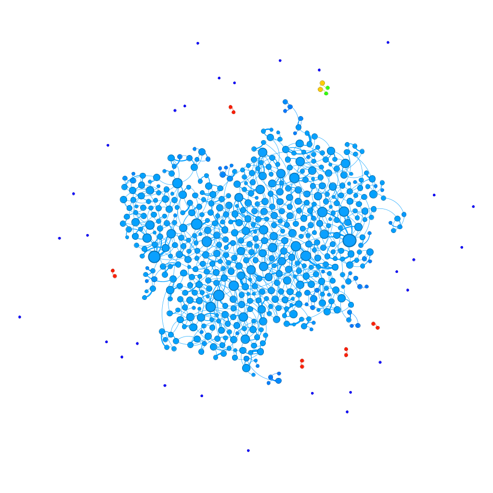
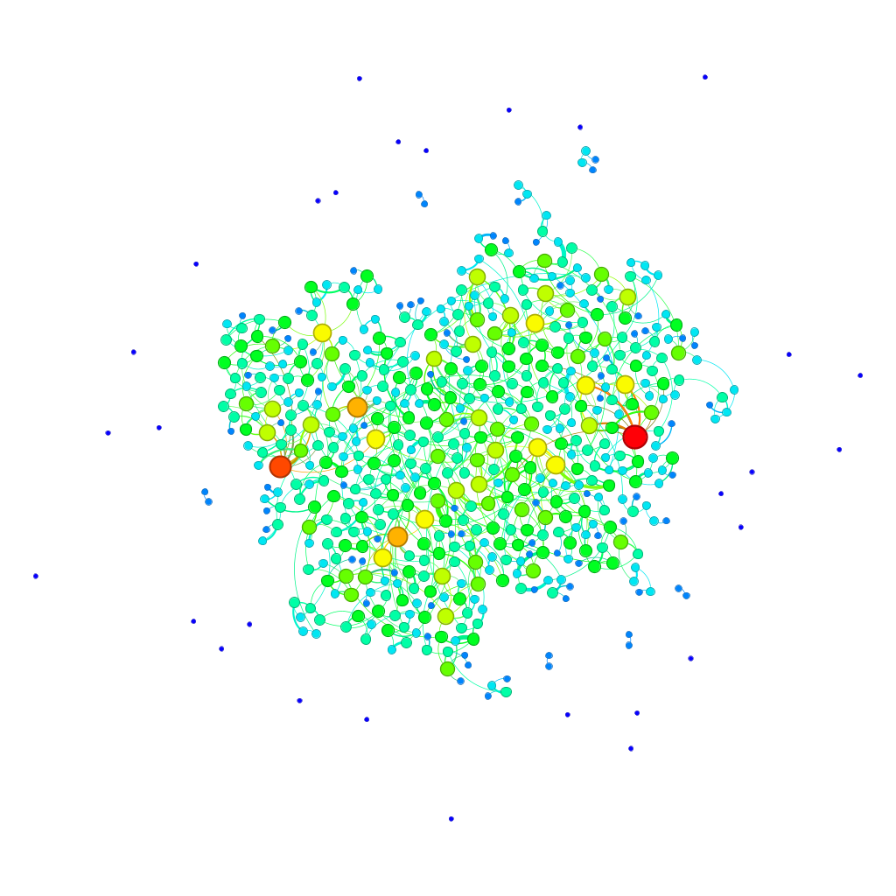
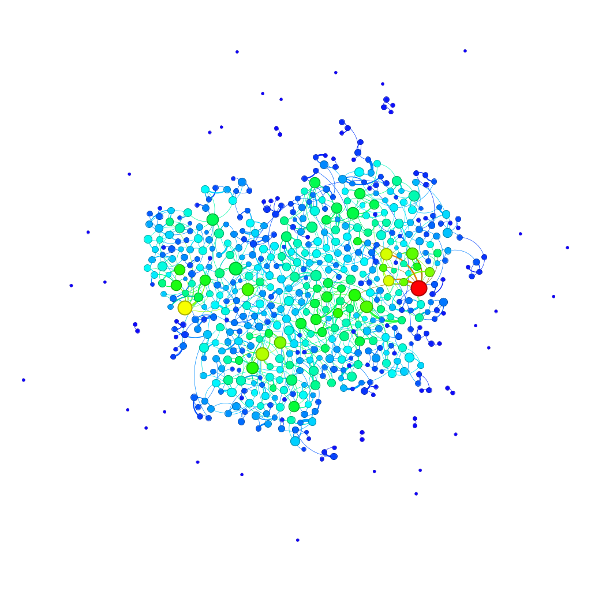
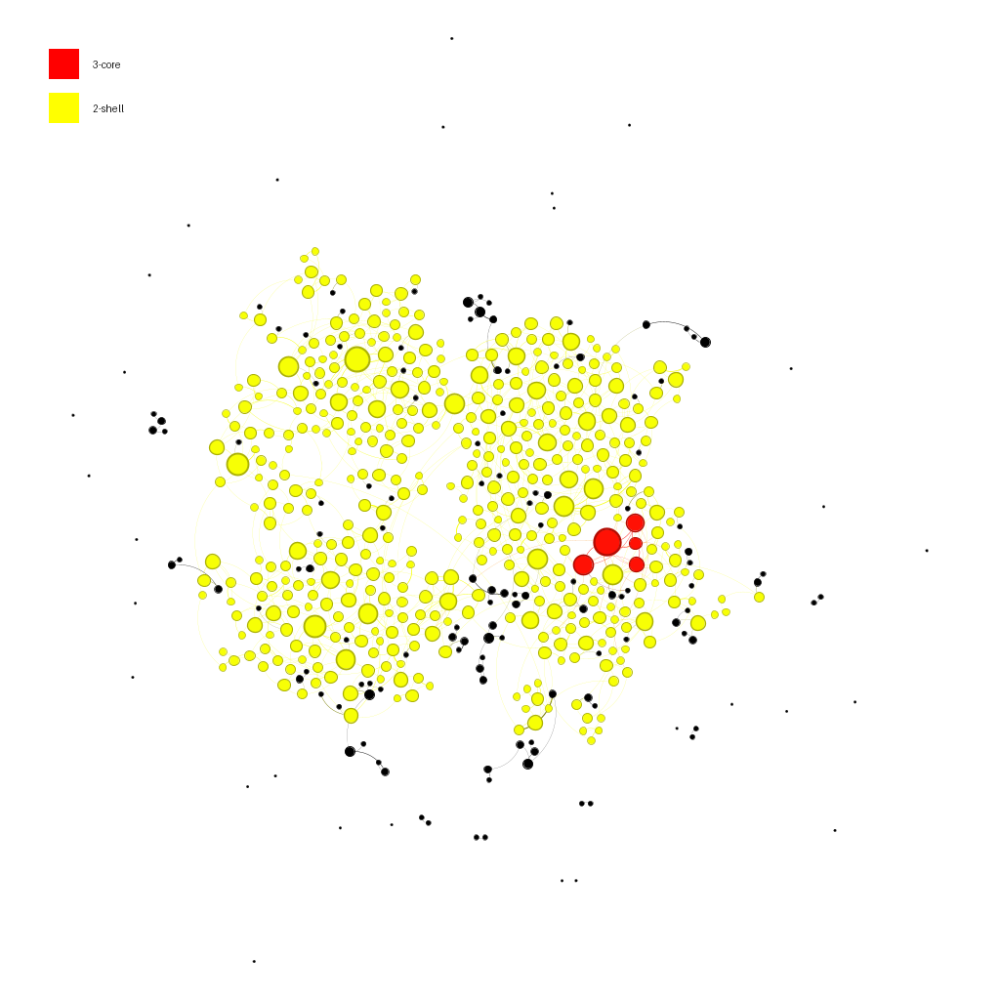

  

<h3 align="center"><strong>UNIVERSIDADE FEDERAL DO RIO GRANDE DO NORTE</strong></h3>

 
DEPARTAMENTO DE ENGENHARIA DE COMPUTAÇÃO E AUTOMAÇÃO 
  
DCA3702 - ALGORITMOS E ESTRUTURAS DE DADOS II  

<h1 align="center"><strong>PROJETO 07 - TRABALHO FINAL PARTE I</strong></h1>

<strong>DISCENTES:</strong> 
- IAN ANTÔNIO FONSECA DE ARAÚJO
- MATHEUS BEZERRA DANTAS SARAIVA 
- MINNAEL CAMPELO DE OLIVEIRA 

<strong>DOCENTE:</strong>  
- IVANOVITCH MEDEIROS DANTAS DA SILVA  

**Natal/RN — 2025**

---

## <strong>1. PROBLEMÁTICA</strong>

A análise de redes complexas tem se mostrado uma ferramenta poderosa para compreender a estrutura e o comportamento de sistemas em diversas áreas do conhecimento. No contexto desta atividade, propõe-se a utilização da ferramenta Gephi para explorar uma rede anonimizada fornecida pelo professor, aplicando os conceitos discutidos ao longo do curso. A proposta central é transformar uma estrutura abstrata de conexões em visualizações compreensíveis, que revelem propriedades estruturais importantes por meio de métricas de centralidade, comunidades e organização em núcleos.

A problemática, portanto, está em como extrair e comunicar, por meio de representações gráficas e métricas quantitativas, características significativas da rede que auxiliem na sua interpretação. Isso exige a escolha criteriosa de layouts, métricas e cores que maximizem a clareza visual e evidenciem os padrões estruturais relevantes. A atividade se insere em um cenário didático que busca não apenas aplicar conhecimentos técnicos, mas também desenvolver a capacidade crítica de interpretar redes complexas em diferentes níveis de profundidade.

---

## <strong>2. DESENVOLVIMENTO</strong>

#### 2.1 REQUISITO 01

O primeiro requisito propõe a criação de uma visualização da rede em que o tamanho dos vértices seja proporcional ao número de vizinhos (grau), enquanto as cores indiquem uma das métricas de centralidade — Closeness, Betweenness, Degree ou Eigenvector Centrality. Essa etapa busca destacar os vértices mais influentes ou centrais segundo diferentes critérios de conectividade e proximidade. A escolha de um layout adequado é essencial para garantir uma boa percepção visual das variações de cor e tamanho, facilitando a identificação de padrões estruturais relevantes. As figuras geradas devem ser acompanhadas de uma descrição interpretativa, relacionando os aspectos visuais com as propriedades topológicas da rede.

#### 2.2 REQUISITO 02

No segundo requisito, o foco recai sobre a identificação e visualização das estruturas internas da rede por meio da análise de k-core e k-shell. Essas técnicas permitem destacar os subconjuntos mais densamente conectados, revelando os vértices que formam o núcleo da rede. A visualização deverá usar o tamanho dos vértices proporcional ao grau de cada nó, reforçando a percepção dos vértices mais conectados. O layout é de livre escolha, desde que favoreça a clareza da estrutura revelada. A descrição da figura deve contextualizar a função do núcleo e das camadas externas, permitindo compreender como esses elementos se distribuem e se organizam na topologia geral da rede.

#### 2.3 REQUISITO 03

Por fim, o terceiro requisito envolve a reprodução da rede em um estado de “produção”, conforme discutido na Semana 14 do curso. Aqui, as cores dos vértices devem indicar a que comunidade pertencem, revelando agrupamentos de nós com alta densidade de conexões internas. Já o tamanho dos vértices pode ser determinado com base em qualquer métrica de livre escolha, possibilitando a personalização da análise conforme o aspecto mais relevante a ser destacado. Essa etapa tem como objetivo evidenciar a modularidade da rede, ou seja, como ela pode ser decomposta em subestruturas com comportamento coletivo, oferecendo uma visão mais segmentada e interpretável de sua organização.

---

## <strong>3. RESULTADOS</strong>

### Resultados

Antes de apresentar os gráficos gerados, é importante destacar a escala de cores utilizada em todas as visualizações. A legenda abaixo representa o gradiente de intensidade que foi adotado para codificar diferentes métricas nos nós da rede — variando do azul (valores mais baixos) ao vermelho (valores mais altos).

  

A rede analisada é composta por 588 nós e 815 arestas, apresentando um grau médio de 2,77 e grau médio ponderado de 4,03. A distância média entre dois nós qualquer é de aproximadamente 9,93, com um diâmetro máximo de 24 e raio mínimo igual a zero, o que sugere a existência de vértices isolados ou perifericamente conectados. A densidade da rede é 0,005, indicando que a rede é bastante esparsa. A análise de comunidades revelou uma modularidade elevada de 0,834, com a detecção de 54 comunidades distintas, sugerindo uma forte estrutura de agrupamentos internos.

Essas métricas ajudam a compreender a topologia geral da rede, contextualizando as representações visuais que seguem. O uso combinado de cor e tamanho nos vértices visa destacar atributos relevantes como centralidade, conectividade e posição relativa, promovendo uma análise mais intuitiva e informativa da estrutura da rede.

A seguir, apresentamos as visualizações geradas no Gephi a partir da rede fornecida, atendendo aos requisitos especificados. Cada imagem é acompanhada de uma breve descrição que destaca os aspectos analisados.

#### Métrica de Centralidade: **Betweenness**

  

Na figura acima, o tamanho dos nós representa o grau de conectividade (número de vizinhos), enquanto a coloração dos vértices é baseada na centralidade de intermediação (*Betweenness Centrality*). Os nós em tons mais quentes (vermelho e laranja) exercem papel fundamental como intermediários na comunicação entre diferentes regiões da rede.

#### Métrica de Centralidade: **Closeness**

  

Nesta visualização, a coloração reflete a centralidade de proximidade (*Closeness Centrality*), evidenciando os nós que possuem menor distância média até os demais. Quanto mais claro o tom, maior é a capacidade do vértice de alcançar rapidamente os outros elementos da rede.

#### Propriedade de Grau: **Degree**

  

A imagem acima apresenta os nós dimensionados proporcionalmente ao seu grau. Os nós maiores são os que possuem mais conexões diretas com outros vértices. Essa representação facilita a identificação de hubs locais que atuam como pontos centrais de atividade na rede.

#### Métrica de Centralidade: **Eigenvector**

  

Por fim, nesta figura, os nós são coloridos de acordo com a centralidade de autovetor (*Eigenvector Centrality*), que considera não apenas o número de conexões de um vértice, mas também a importância dos vizinhos com os quais ele está conectado. Isso permite detectar influência estrutural mais ampla na rede.

#### Análise de Núcleo: **K-core e K-shell**

  

A imagem acima evidencia a estrutura da rede por meio da decomposição em *k-core* e *k-shell*. Os nós destacados em vermelho pertencem ao núcleo 3-core, ou seja, formam um subgrafo no qual cada vértice possui, no mínimo, três conexões com outros vértices do mesmo grupo. Já os nós em amarelo compõem o 2-shell, representando uma camada menos densa ao redor do núcleo. O tamanho dos vértices foi ajustado de forma proporcional ao grau (número de conexões), permitindo identificar os vértices mais conectados dentro de cada camada.

#### Detecção de Comunidades e Visualização Interativa

O terceiro requisito propõe a análise da estrutura modular da rede por meio da detecção de comunidades, técnica fundamental para identificar agrupamentos de nós que compartilham conexões mais densas entre si do que com o restante da rede. Nesta etapa, as cores dos vértices representam as comunidades detectadas por meio de algoritmos de maximização de modularidade, enquanto o tamanho dos vértices foi definido com base em uma métrica de livre escolha (como grau, centralidade ou outro parâmetro estrutural). Essa combinação permite não apenas visualizar a posição dos nós dentro de cada grupo, mas também avaliar a importância relativa de cada vértice no interior das comunidades.

Como complemento às imagens estáticas, foi criada uma visualização interativa em formato de página web, onde é possível explorar dinamicamente a rede com zoom, seleção de nós e inspeção de atributos. Essa interface proporciona uma compreensão mais aprofundada da estrutura global e local da rede, favorecendo a investigação de padrões e a identificação de vértices de interesse com base em múltiplos critérios. A ferramenta foi especialmente útil para observar como os agrupamentos se organizam no espaço topológico da rede e como se conectam entre si.

A visualização interativa está disponível na seção **Informações Complementares** a seguir.

## <strong>Informações Complementares</strong>

Este repositório reúne todos os materiais utilizados para desenvolvimento do projeto, incluindo os notebooks com comentários detalhados e os arquivos de visualização.

- Página gerada no [GEPHI](https://mbdsaraiva.github.io/Complex-structures-and-graphs/WEB/)

- Os prompts utilizados durante o processo estão documentados na pasta [`MD`](https://github.com/mbdsaraiva/Complex-structures-and-graphs/tree/main/MD).

- O notebook em Python com toda a lógica do algoritmo bem como os dados aqui utilizados está disponível na pasta [`JUPYTER`](https://github.com/mbdsaraiva/Complex-structures-and-graphs/tree/main/JUPYTER).

---

